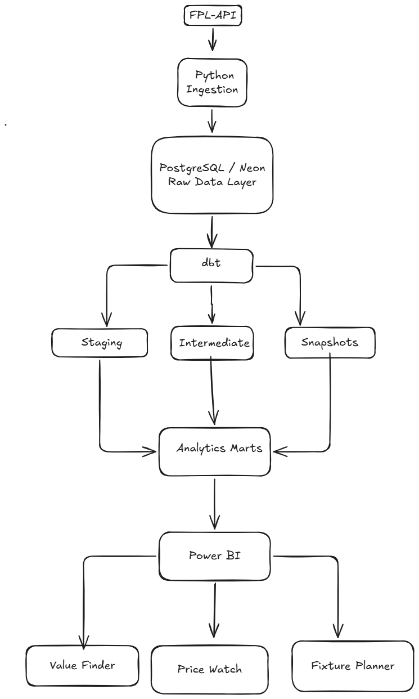
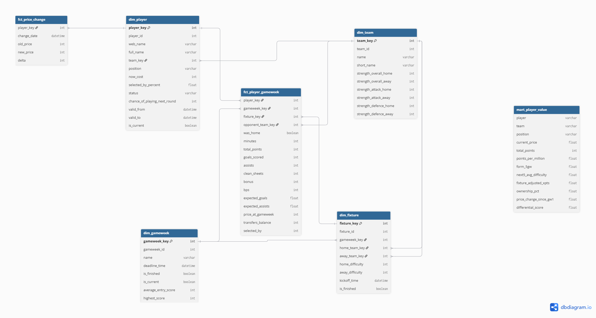
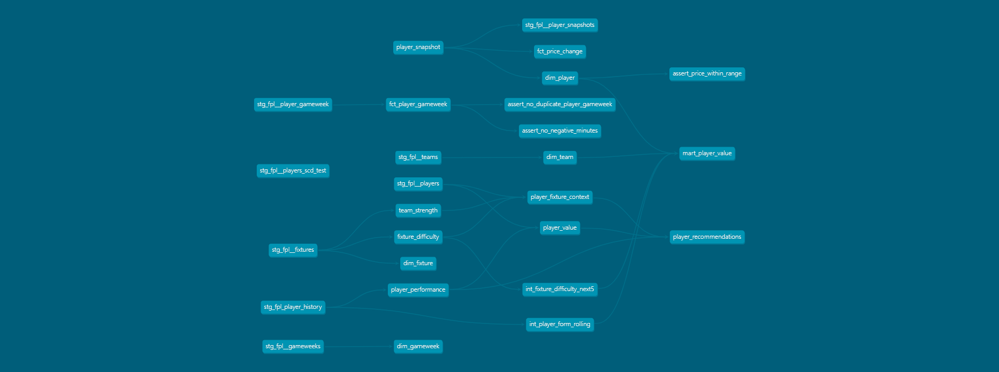
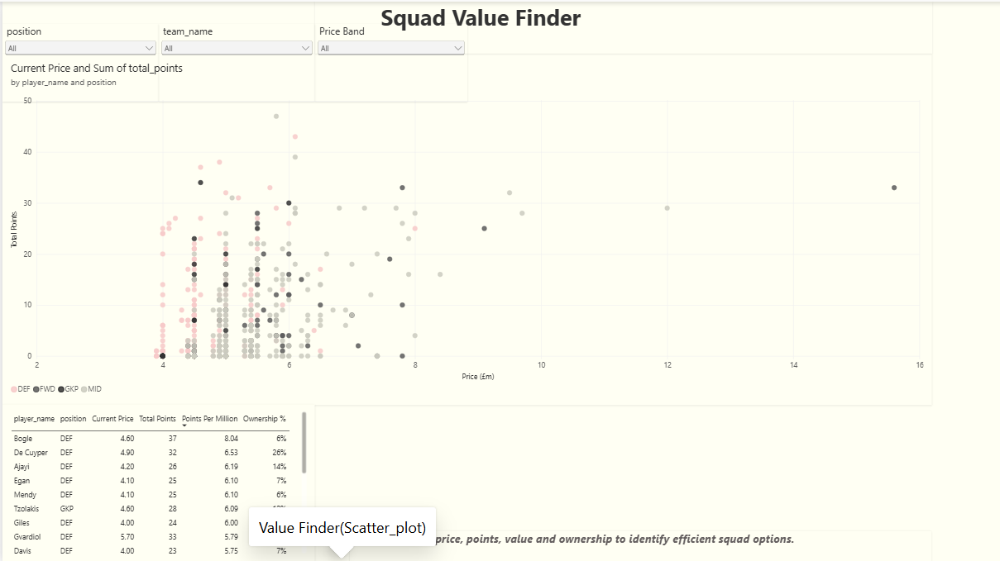
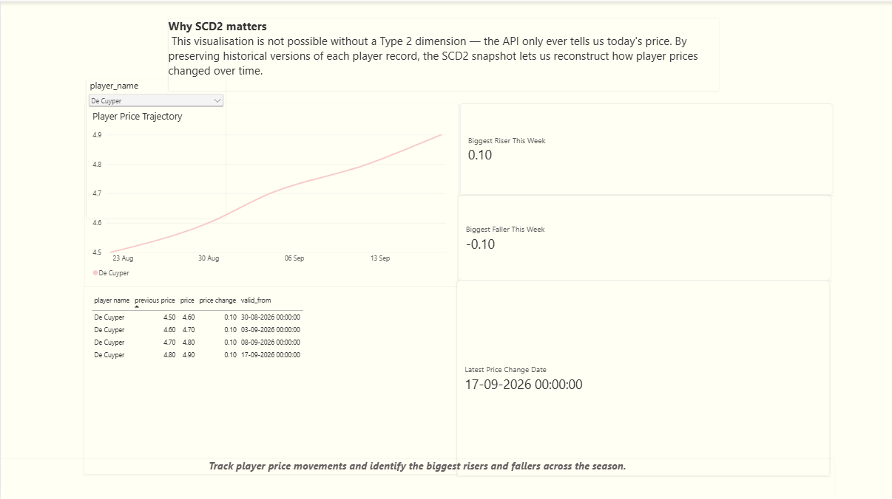
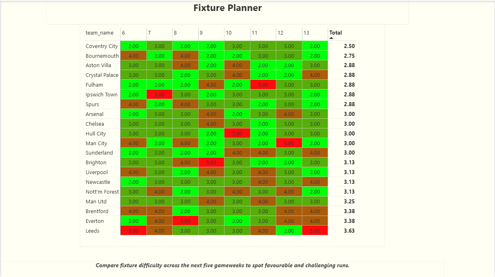

# FPL Edge ⚽📊

> An end-to-end Fantasy Premier League data engineering and analytics platform that turns continuously changing FPL data into a tested, modelled, and decision-ready analytics layer.

FPL Edge ingests Fantasy Premier League data, stores raw historical observations in PostgreSQL, transforms the data with dbt, preserves changing player attributes using Type 2 snapshots, builds analytical facts and dimensions, and exposes the resulting data through an interactive Power BI dashboard.

The goal is not simply to analyse FPL data once.

The goal is to build a reproducible pipeline that can **ingest changing data, preserve history, transform it reliably, test the outputs, and produce analysis-ready datasets.**

---

## 📌 What FPL Edge Does

FPL Edge is designed to answer questions such as:

- Which players provide the best points relative to their price?
- Which players are gaining or losing value?
- How have player prices changed over time?
- Which teams have the easiest upcoming fixtures?
- How do ownership, form, price, and fixture difficulty interact?
- Which players provide potential differential value?

These signals are transformed into analytical datasets and presented through Power BI.

---

## 🏗️ Architecture



---

## 🔧 Why This Is a Data Engineering Project

FPL Edge is built as a complete data pipeline rather than a one-time analysis.

The project handles several problems that occur when working with continuously changing data:

- **Data ingestion** — FPL data is collected programmatically and stored as raw observations.
- **Historical data** — raw observations are retained so that changes over time can be reconstructed.
- **Data modelling** — raw API data is transformed into structured dimensions, facts, and analytical models.
- **Incremental processing** — gameweek performance data is processed without rebuilding the entire analytical dataset unnecessarily.
- **Historical tracking** — changing player attributes are preserved using dbt Type 2 snapshots.
- **Data quality** — dbt tests validate relationships, uniqueness, accepted values, and model integrity.
- **Analytics delivery** — the transformed data is consumed by Power BI for interactive analysis.
- **Automation** — the pipeline can be executed through GitHub Actions rather than relying entirely on manual execution.

This creates a workflow of:

**Ingest → Store → Transform → Test → Model → Analyse**

---

## 🛠️ Tech Stack

| Layer | Technology | Purpose |
|---|---|---|
| Data Source | Fantasy Premier League API | Source of player, fixture, gameweek, and performance data |
| Ingestion | Python | Extract and load raw FPL data |
| Database | PostgreSQL / Neon | Store raw and analytical datasets |
| Transformation | dbt | Build staging, intermediate, and mart models |
| Historical Tracking | dbt Snapshots | Preserve changing player attributes using SCD Type 2 |
| Data Quality | dbt Tests | Validate analytical models |
| Analytics | Power BI | Interactive dashboards and decision-support visuals |
| Automation | GitHub Actions | Automate the data pipeline |
| Version Control | Git / GitHub | Track code, models, documentation, and project changes |

---

## 🗂️ Data Model & Grain

FPL Edge separates the analytical layer into dimensions, facts, and supporting models.

### Core Dimensions

- `dim_player` — player attributes and current player information.
- `dim_team` — Premier League team information.
- `dim_gameweek` — gameweek metadata and deadlines.
- `dim_fixture` — fixture information including teams, kickoff information, and difficulty.

### Core Fact

- `fct_player_gameweek` — player performance at a gameweek level.

**Primary analytical grain:**

> One row per player per gameweek.



This grain allows player performance to be analysed across time while connecting player, team, gameweek, and fixture dimensions.

### Supporting Models

Additional analytical models are used for areas such as:

- Player-fixture context
- Historical price tracking
- Price changes
- Gameweek-level player prices

---

## 🕒 Historical Data & SCD Type 2

FPL data is constantly changing. Player prices, ownership, status, performance statistics, and other attributes can change throughout the season.

A simple database containing only the latest API response would lose those historical states.

FPL Edge addresses this using two complementary approaches.

### Raw Historical Observations

Each ingestion stores the API response as a dated raw observation in PostgreSQL.

This means the pipeline retains the data received at different points in time instead of continuously overwriting the previous state.

This historical raw layer is used to reconstruct changes such as:

- Player price movements
- Ownership changes
- Player status changes
- Changes in performance statistics
- Other evolving FPL attributes

### dbt Type 2 Snapshot

For changing player attributes, FPL Edge also uses a dbt **SCD Type 2 snapshot**.

Instead of replacing an existing player record, the snapshot creates a new historical version when tracked attributes change.

Conceptually:

```text
Player
  │
  ├── Version 1
  │      valid_from ───────── valid_to
  │
  ├── Version 2
  │      valid_from ───────── valid_to
  │
  └── Current Version
         valid_from ───────── NULL
---
## 🧱 dbt Transformation Layer

dbt is used to transform the raw FPL data into structured analytical datasets.

The project separates transformations into different layers so that each model has a clear responsibility.

### Staging

Staging models clean and standardise data coming from the raw source tables.

Typical responsibilities include:

- Selecting required fields
- Renaming columns
- Standardising data types
- Preparing source data for downstream models

### Intermediate

Intermediate models combine and transform staging data to create reusable business logic.

Examples include:

- Player-fixture context
- Gameweek-level player price history
- Other intermediate datasets used by the analytical marts

### Marts

The mart layer contains the datasets designed for direct analytical consumption.

Key models include:

- `dim_player`
- `dim_team`
- `dim_gameweek`
- `dim_fixture`
- `fct_player_gameweek`
- `fct_price_change`

These models provide the structured analytical layer consumed by Power BI.

### Incremental Modelling

The `fct_player_gameweek` model uses incremental processing so that new gameweek data can be added without unnecessarily rebuilding the complete historical fact table.

### dbt Lineage

The project also documents the relationships between models using the dbt lineage graph.



This makes the transformation dependencies visible from raw sources through intermediate models and into the final analytical marts.

---

## 🔄 Data Pipeline

FPL Edge follows a layered pipeline that separates ingestion, storage, transformation, testing, and analytics.

### 1. Ingestion

Python ingestion scripts collect data from the Fantasy Premier League API.

The ingestion layer captures data such as:

- Players
- Teams
- Fixtures
- Gameweeks
- Player gameweek performance

The API responses are stored as raw observations in PostgreSQL rather than being immediately transformed or discarded.

### 2. Raw Data Layer

The raw layer acts as the historical source of truth for the pipeline.

Each ingestion is associated with metadata such as:

- Ingestion timestamp
- Source file
- API dataset

Keeping this layer separate means downstream models can be rebuilt from the stored raw data without requiring the API to be called again.

### 3. dbt Transformation Layer

dbt transforms the raw data through multiple modelling layers:

```text
Raw Sources
     │
     ▼
Staging Models
     │
     ▼
Intermediate Models
     │
     ▼
Marts
     │
     ▼
Power BI


### 4. Data Quality

dbt tests are executed against the analytical models to catch problems such as:

- Duplicate records
- Missing key values
- Invalid relationships
- Unexpected values
- Referential integrity issues

The project currently has **53 automated dbt tests** covering the analytical layer.

### 5. Orchestration

The pipeline is configured to run through GitHub Actions.

The automated workflow performs the major pipeline steps:

```text
Python Ingestion
       │
       ▼
   dbt Snapshot
       │
       ▼
     dbt Run
       │
       ▼
    dbt Test

---

## 📊 Power BI Analytics

The transformed analytical models are consumed by Power BI to provide an interactive analytics layer.

The dashboard is organised around three analytical views.

### 1. Squad Value Finder

The Squad Value Finder is designed to compare players across price, performance, ownership, and position.

Key metrics include:

- Current price
- Total points
- Points per million
- Ownership
- Position
- Team

Interactive slicers allow the player pool to be filtered by:

- Position
- Team
- Price band

A player comparison table complements the scatter plot to make individual player analysis easier.



### 2. Price Watch

The Price Watch page focuses on player price movements over time.

It combines historical price observations with the price-change model to show:

- Player price trajectories
- Previous and new prices
- Price changes
- Recent price risers
- Recent price fallers
- Gameweek-level price history

The historical price model combines an initial gameweek price seed with subsequently ingested FPL observations to reconstruct price movement from the beginning of the season.



### 3. Fixture Planner

The Fixture Planner provides a gameweek-level view of upcoming fixture difficulty.

The view uses:

- Teams as rows
- Upcoming gameweeks as columns
- Fixture difficulty as the heatmap value
- Conditional formatting to make fixture difficulty visually comparable
- Drill-through to player-level fixture context

This connects fixture difficulty with player analysis instead of treating fixtures as an isolated dataset.



---

## ⚖️ Design Decisions & Tradeoffs

### Control Table vs Text File

The project uses PostgreSQL as the persistent raw data layer instead of relying only on local text or JSON files.

This keeps ingested observations queryable and allows downstream dbt models to be rebuilt from stored data without repeatedly calling the FPL API.

### Import vs DirectQuery

Power BI uses **Import mode** rather than DirectQuery.

The analytical dataset is relatively small and the dashboard does not require real-time querying. Import mode provides responsive dashboard interactions while allowing the full dataset to be refreshed after the pipeline runs.

### Snapshot Check Strategy vs Timestamp

Player history is handled using a dbt **check-based snapshot strategy**.

The snapshot tracks selected player attributes and creates a new historical version when those values change. This was chosen because the goal is to capture meaningful changes in player state rather than treating every ingestion timestamp as a new version.

### Raw Observations vs Latest-State Data

The raw layer retains historical API observations rather than keeping only the latest response.

This allows the project to reconstruct changes such as player price movements and provides a historical source that downstream models can use without repeatedly requesting the API.

### Rate Limiting and Ingestion Frequency

The ingestion process is designed around periodic collection rather than continuous requests.

Because FPL data does not require second-by-second updates for this analytical use case, controlled ingestion reduces unnecessary API requests while still providing sufficient historical observations for the dashboard and analytical models.

### Layered dbt Architecture

The transformation layer is divided into **staging, intermediate, and marts** rather than placing all SQL logic into a single model.

This makes transformations easier to test, reuse, debug, and maintain as the project grows.

---
## ▶️ How to Run

### 1. Clone the repository

```powershell
git clone <repository-url>
cd FPL-Edge
```

### 2. Create and activate the Python environment

```powershell
python -m venv venv
.\venv\Scripts\Activate.ps1
```

### 3. Install dependencies

```powershell
pip install -r requirements.txt
```

### 4. Configure the database

```powershell
$env:DATABASE_URL="your-postgresql-connection-string"
```

### 5. Run the ingestion pipeline

```powershell
# Run the Python ingestion scripts from the project root.
# The ingestion layer collects FPL data and stores the raw observations in PostgreSQL.
```

### 6. Run dbt

```powershell
cd dbt\fpl_edge

dbt debug
dbt snapshot
dbt run
dbt test
```

### 7. Open the Power BI report

```text
Open the Power BI report and refresh the dataset
after the PostgreSQL analytical models have been updated.
```

### Complete pipeline

```text
FPL API
   ↓
Python Ingestion
   ↓
PostgreSQL Raw Layer
   ↓
dbt Snapshot
   ↓
dbt Run
   ↓
dbt Test
   ↓
Power BI
```

---
## 📁 Project Structure

```text
FPL-Edge/
│
├── data/
│   └── raw/
│       └── bootstrap/
│
├── dbt/
│   └── fpl_edge/
│       ├── models/
│       │   ├── staging/
│       │   ├── intermediate/
│       │   └── marts/
│       │
│       ├── snapshots/
│       ├── seeds/
│       ├── tests/
│       └── dbt_project.yml
│
├── ingestion/
│   └── Python ingestion scripts
│
├── docs/
│   ├── architecture.png
│   ├── schema.png
│   ├── dbt_lineage.png
│   └── images/
│       ├── squad_value_finder.png
│       ├── price_watch.png
│       └── fixture_planner.png
│
├── scripts/
│   └── validation and utility scripts
│
├── .github/
│   └── workflows/
│       └── daily_pipeline.yml
│
├── requirements.txt
└── README.md

---


## 🧪 Data Quality & Testing

Data quality is treated as part of the pipeline rather than as a separate manual step.

FPL Edge uses dbt tests to validate the analytical models before the data reaches Power BI.

The test suite covers areas such as:

- Primary key uniqueness
- Required fields
- Relationships between fact and dimension tables
- Accepted values
- Referential integrity
- Model-level data consistency

The pipeline currently passes **53 automated dbt tests**.

The validation flow is:

```text
Raw Data
   │
   ▼
dbt Transformations
   │
   ▼
dbt Tests
   │
   ├── Pass ──► Power BI
   │
   └── Fail ──► Pipeline stops for investigation

---

## 🚀 What I Would Do Next

The current pipeline provides the foundation for a larger FPL analytics platform.

Potential next steps include:

- Automate daily Power BI dataset refreshes
- Add player recommendation scoring
- Expand historical price and ownership analysis
- Add automated anomaly detection for unexpected data changes
- Introduce a production-grade orchestration layer
- Add more comprehensive data observability and pipeline monitoring
- Add player-level fixture-adjusted projections
- Expand the dashboard with additional performance and predictive metrics

These improvements would extend FPL Edge from an analytical pipeline into a more comprehensive FPL decision-support platform.

---

## 💻 Key Implementation Examples

The project uses Python, SQL, dbt, and DAX across different stages of the pipeline.

### Python — API Ingestion

Python is used to retrieve data from the FPL API and process the incoming responses before storing them in the raw layer.

```python
response = requests.get(FPL_BOOTSTRAP_URL)
response.raise_for_status()

data = response.json()

## ⚖️ Design Decisions & Tradeoffs

### Control Table vs Text File

The pipeline uses a database-backed raw layer rather than relying only on local text files.

This makes historical observations queryable and allows downstream dbt models to be rebuilt without repeatedly calling the API.

### Import vs DirectQuery

Power BI uses Import mode because the dataset is relatively small and the dashboard does not require real-time querying.

Import mode provides better interactive performance and full DAX modelling capabilities while allowing the pipeline to refresh the dataset on a scheduled basis.

### Snapshot Strategy

dbt snapshots use a check-based strategy for selected player attributes.

This preserves historical versions when tracked values change rather than treating the latest API response as the only state.

### Rate Limiting

The ingestion layer is designed to avoid unnecessarily aggressive API requests by controlling request frequency and separating ingestion from downstream transformation.

This reduces dependence on repeated API calls and allows the raw historical layer to act as the source for rebuilding analytical models.

---

## 🔎 Sample Insights

The current analytical models produce several useful signals from the FPL data.

- **Price movement:** On 20 September 2026, Alderete, Eccles, Mehmeti, Minteh and Mudryk each recorded a **£0.1m price decrease**.

- **Player value:** Groß recorded **47 total points at a £5.8m price**, giving him **8.10 points per million** in the current dataset.

- **Fixture difficulty:** Across **GW6–GW10**, Fulham and Coventry City had the lowest average fixture difficulty in the returned results, at **2.4**.

These examples demonstrate how the underlying data models can be used to surface player value, price movement, and fixture-related signals through the Power BI dashboard.

---
